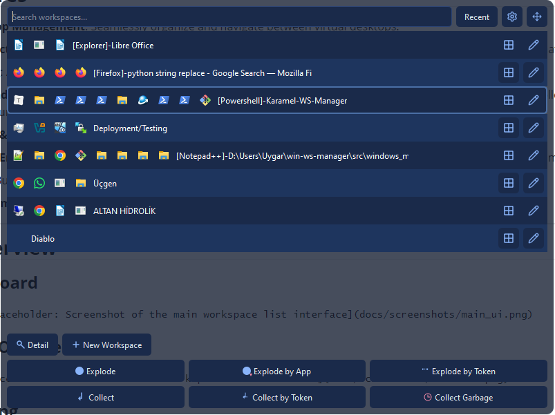
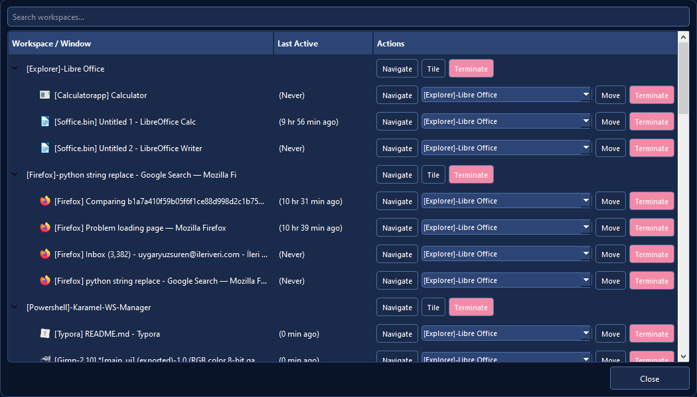
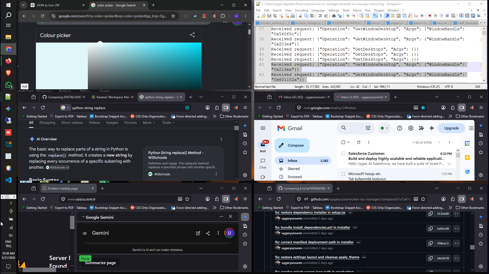

 

# Karamel Workspace Manager

Karamel Workspace Manager is a professional-grade Windows utility designed to streamline multi-tasking by managing virtual desktops, tiling windows, and tracking application activity across your workspace.

## Key Features

- **Virtual Desktop Management**: Seamlessly organize and navigate between virtual desktops.
- **Background Activity Tracking**: Monitors window usage with a high-performance daemon, ensuring you always know what you've been working on.
- **Window Tiling**: Automatically organize your open applications with a simple grid tiling layout.
- **Advanced Window Management**: Efficiently reorganize your workspace with 'Explode' (tiling across workspaces) and 'Collect' (grouping windows by app or token) functionalities.
- **Smart Search & Navigation**: Instantly filter workspaces and applications by title and navigate to them with a single click.
- **Visual Theme Engine**: A rich, dynamic theme system with support for 12+ pre-configured light and dark visual themes to match your aesthetic.
- **Localized UI**: Built with support for 24 languages, ensuring accessibility for a global user base.
- **Resource Optimized**: Low-memory background service with automated cleanup and self-contained binary deployment.

---

## Visual Overview

### Main Dashboard

### Workspace Overview

### Window Tiling

---

## Installation

Karamel Workspace Manager is distributed as a single executable installer. 
1. Download the latest `KaramelInstaller.exe` from the releases page.
2. Run the installer as Administrator.
3. The installer will automatically check and configure the necessary system dependencies (.NET runtime, Visual C++ Redistributables).
4. Launch the application from your desktop or Start Menu.
5. Enter your evaluation key: 123456789
6. Use ESC key to minimize to tray, define a Ctrl+Alt shortcut key on settings panel to pop it up quickly.
7. To monitor last window activities and recent windows, activate this feature on settings panel.

---

## Configuration

Settings can be managed directly through the application's Settings panel. 
- **Activity Tracking**: Toggle background window tracking to get insights on workspace usage.
- **Theme Customization**: Choose between various light and dark themes to match your workflow.

---

## Support & Feedback
For issues, feature requests, or contributions, please open an issue in the GitHub repository.
